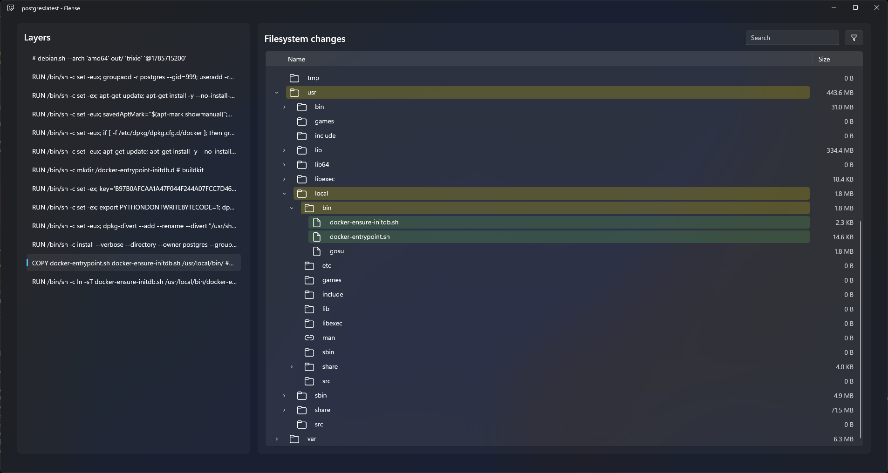

# Flense

> flense /ˈflɛns/ (v) to strip the blubber or skin from, as from a whale.

A WinUI 3 desktop app for analysing Docker images, following in the footsteps of [wagoodman/dive](https://github.com/wagoodman/dive) or
[fudanglp/peel](https://github.com/fudanglp/peel).



## Why does this exist?

I use `dive` often, and while it is an incredible tool that has helped me a lot, it's slow for larger images. While researching
the image analysis tool space before starting this project, I came across `peel` which is much faster. But the seed had already
been planted in my brain. Perhaps it was Raymond Chen's blog that put it there. Perhaps it was my nameless coworker who kept sending
me memes about the Win32 API. I needed to write a WinUI 3 C++/WinRT app.

Part of me feels like I'm offering this app as a heartfelt apology for the war crimes committed in my tenure thus far as a software
engineer. I've written code you people wouldn't believe. React GUIs claiming the JavaScript heap as their birthright. C# code
calling the database so often that MSSQL filed a restraining order. I watched C++ threads fight for a mutex like commuters for a
train door at Shinjuku station.

This project (if I finish it) will be a love letter to deeply-integrated and fluid native apps. I do honestly believe that
a tool like this benefits from a native GUI that you can navigate using your mouse, but perhaps I've over-corrected
in not using Avalonia, or Qt, or even just WinUI with CsWinRT.

## Feature comparison

Flense is still a work in progress, and lacks some of the features present in Dive, although basic image analysis functionality does work.

| Feature                                            | Flense | Dive |
| -------------------------------------------------- | ------ | ---- |
| Import from .tar files                             | ✅     | ✅   |
| Import from stored Docker images                   | ❌     | ✅   |
| Import from remote Docker images                   | ❌     | ✅   |
| View layer filesystems                             | ✅     | ✅   |
| View folder and file sizes                         | ✅     | ✅   |
| Filter layer filesystems by name                   | ✅     | ✅   |
| Filter layer filesystems by added/removed/modified | ✅     | ✅   |
| View file permissions                              | ❌     | ✅   |
| Sort by size                                       | ❌     | ✅   |
| Extract files                                      | ❌     | ✅   |
| View layer commands                                | ✅     | ✅   |
| View layer metadata                                | ❌     | ✅   |
| View image metadata                                | ❌     | ✅   |
| Report image efficiency / wasted space             | ❌     | ✅   |
| Mouse controls                                     | ✅     | ❌   |

## Benchmarks

Benchmarks of the core image parsing against .tar files are included below. Tests are done using the headless benchmarking harness with three sample images:

- `postgres:latest`, a relatively light application container
- `mcr.microsoft.com/devcontainers/cpp:latest`, a moderate size dev container with compilers
- `nvidia/cuda`, a much larger development image

These results are measured on a desktop machine with the following specifications:

- AMD Ryzen 7 5800X CPU
- 32 GB of DDR4 RAM
- 1TB Samsung 870 QVO SSD

The median figure provided is across 5 runs.

The benchmark harness uses `FILE_FLAG_NO_BUFFERING` to simulate a cold read, to represent a realistic use case in which the target image
is analysed for the first time and is not in the disk cache.

| Image                                        | `.tar` size | Median cold parse time | Peak memory usage |
| -------------------------------------------- | ----------- | ---------------------- | ----------------- |
| `postgres:latest`                            | 164 MB      | 0.47 s                 | 145.9 MiB         |
| `mcr.microsoft.com/devcontainers/cpp:latest` | 805 MB      | 2.03 s                 | 163.0 MiB         |
| `nvidia/cuda:latest`                         | 2.22 GB     | 4.97 s                 | 139.2 MiB         |

Below are the comparison results for `dive` v0.13.1 parsing the same archives with `--ci`. To simulate cold reads without modifying the source code,
the benchmark invokes `SetSystemFileCacheSize` with `-1` before each `dive` call, which is documented as a way to flush the filesystem cache. This
is not quite the same as disabling buffering entirely, but is the best substitute I can think of.

| Image                                        | `.tar` size | Median cold parse time | Peak memory usage |
| -------------------------------------------- | ----------- | ---------------------- | ----------------- |
| `postgres:latest`                            | 164 MB      | 2.01 s                 | 37.8 MiB          |
| `mcr.microsoft.com/devcontainers/cpp:latest` | 805 MB      | 9.95 s                 | 109.3 MiB         |
| `nvidia/cuda:latest`                         | 2.22 GB     | 12.66 s                | 20.6 MiB          |

## Architecture

### Project layout

- `Flense/`: the WinUI 3 desktop app (C++/WinRT), which calls into Flense.Core for all analysis tasks
- `Flense.Core/`: a portable core library (plain C++, no WinRT/Windows headers)
- `Flense.Benchmarks/`: a harness used to benchmark Flense.Core in a headless/non-GUI context

### Design decisions

#### Platform-agnostic core library

The platform agnostic core library exists so that the central image parsing logic can be used as the backend for a different native GUI, if desired in a later stage of the project. It is a constraint of the native GUI approach used that supporting additional platforms would require writing an entirely separate GUI, but this GUI should not have to re-implement all of the image parsing logic.

Therefore, the core library implements this logic using portable C++, and allows callers to supply abstractions for platform-specific tasks such as reading files.

If we do go cross-platform, we will have to put some thought into the build system we use. The project uses MSBuild right now, as it is the only officially-supported tool for building WinUI applications. CMake looks like the strongest candidate, based on [experimental support for it in the Windows App SDK](https://github.com/microsoft/WindowsAppSDK/discussions/6446) and good integration in Visual Studio, alongside working quite well across macOS and Linux.

#### Tree representation with `std::shared_ptr`

Each layer of an OCI image is a tarball that contains filesystem diffs for that layer - i.e. it contains any files that were changed or added in that layer (named with a .wh to signal deletion). Because we want to be able to browse the full image filesystem at _any_ layer, it is important to be able to re-use nodes that we defined in earlier layers.

To achieve this, filesystems are represented using an immutable tree based on `std::shared_ptr`. This means that if a single file is added, then the tree can be copied and share all of the previous layer's nodes, save for the newly added path. For example, when parsing `postgres:latest`, we require 79,711 nodes to represent the filesystem at each layer, but only 19,879 of these nodes have a distinct pointer address, meaning that nodes are re-used in roughly 75% of cases.

Future work could improve this by switching to a custom reference-counted pointer or arena allocation that does not require an atomic reference count increment on copy, as individual trees should not need to be accessed by multiple threads at once.

#### Multi-threading

Image parsing in the core library is multi-threaded to improve performance. Most of the parsing time is spent in decompressing the layer blobs inside the Docker `.tar` archive format, which tend to be compressed with `gzip`. While multi-threaded `gzip` decompression algorithms do exist, they usually require the data to have been compressed in a special way such that there are parallel deflate streams in the file. I assume this is unlikely to be the case for exported OCI images, as it is not mentioned in the specification. Therefore, parallelism is achieved by decompressing and parsing layer blobs across multiple threads. When all threads are finished, a final sequential pass is done serially, in layer order, to combine each layer's reported diffs and produce the final filesystem snapshots.

The threading architecture has one thread as a producer reading the outer archive, and reading chunks from the files within. It performs a probe into each file, and if it detects a compressed layer blob, it will spin up a new consumer thread and start sending file chunks to it for decompression. Other types of image content, e.g. JSON metadata, are parsed directly on the reader thread. The producer thread will eventually send across the entire entry and move on to the next compressed blob while the worker finishes parsing all of the data it has been given.

To avoid the producer thread from advancing too far ahead of the consumers, and buffering too much of the image file in memory, the producer thread is required to read file chunks into a buffer rented from a pool before handing them to consumers. When a consumer completes processing a buffer, it is returned to the pool. If the producer encounters a number of particularly large layers, the pool may be exhausted, in which case the producer will block on acquiring a buffer and pause file reading until some consumers have progressed and returned their buffers. This approach allows us to place a cap on the amount of the file buffered in RAM, a.k.a. `buffer_size * pooled_buffers_count`. The cap is currently defined statically but could be updated to be determined at runtime based on the available system memory. (This cap is why, in the benchmarks above, parsing usually caps out at around 150 MB of memory on even the largest images.)

## Contributing

### Dev environment

- **OS:** Windows 11 (Windows App SDK / WinUI 3 desktop app)
- **IDE/toolchain:** Visual Studio 2026 with the C++ desktop, Windows App SDK, and clang-cl workloads. See the container's [vsconfig](Container/vs.vsconfig) for a precise list.
- **Language:** C++20 built with MSVC
- **Formatting:** `.clang-format` at the repo root
- **Third-party C++ dependencies:** [vcpkg](https://github.com/microsoft/vcpkg), in manifest mode. Install it anywhere (e.g. `X:\vcpkg`), bootstrap
  it (`bootstrap-vcpkg.bat`), and run `vcpkg integrate install` once for machine-wide MSBuild integration. `vcpkg.json` at the repo root declares
  dependencies; `Directory.Build.props` points both projects at it via `VcpkgManifestRoot`.
- **Building:** open `Flense.slnx` in Visual Studio and build, or from the command line:

  ```
  msbuild Flense.slnx /p:Configuration=Debug /p:Platform=x64
  ```

- **Running:** Flense is an MSIX-packaged app (`Package.appxmanifest`, `AppxPackage=true`). Run it via Visual Studio (F5/deploy) rather than
  launching the `.exe` directly. Requires Developer Mode enabled to sideload/debug locally.

### Sandboxed build container

There is an optional Windows container that carries the whole toolchain, intended for running
Claude Code (or any agent) against the repo without giving it access to the rest of the machine. It builds
Flense but cannot run the app as there is no GUI stack in the container.

To use it, run the script:

```
.\Scripts\enter-claude.container.ps1
```

The script tries to fix container permissions as it enters, because named volumes on Windows seem to be a nightmare to deal with in this regard. If Claude reports that it can't write transcripts or keeps making you log in again, there is probably a permissions issue that the script has been unable to fix.
