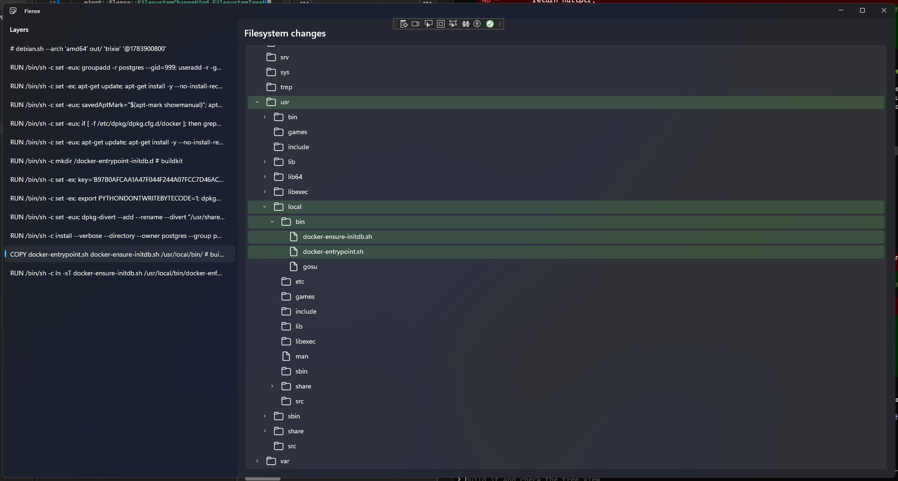

# Flense

> flense /ˈflɛns/ (v) to strip the blubber or skin from, as from a whale.



A WinUI 3 desktop app for analysing Docker images, following in the footsteps of [wagoodman/dive](https://github.com/wagoodman/dive) or 
[fudanglp/peel](https://github.com/fudanglp/peel).

## Why does this exist?

I use `dive` often, and while it is an incredible tool that has helped me a lot, it's slow for larger images. While researching 
the image analysis tool space before starting this project, I came across `peel` which is much faster. But the seed had already 
been planted in my brain. Perhaps it was Raymond Chen's blog that put it there. Perhaps it was my nameless coworker who kept sending
me memes about the Win32 API. I needed to write a WinUI 3 C++/WinRT app.

Part of me feels like I'm offering this app as a heartfelt apology for the war crimes committed in my tenure thus far as a software
engineer. I've written code you people wouldn't believe. React GUIs claiming the JavaScript heap as their birthright. C# code 
calling the database so often that MSSQL filed a restraining order. I watched C++ threads fight for a mutex like commuters for a 
train door at Shinjuku station.

This project, if I ever actually finish it, will be a love letter to deeply-integrated and fluid native apps. Perhaps I've over-corrected 
in not using Avalonia, or Qt, or even just CsWinRT, but I want it all. Every efficiency saving, every opportunity to look as native as possible.
Even if it means I lose my sanity in the process, and start writing my shopping lists in MIDL.

## Project layout

- `Flense/` — the WinUI 3 desktop app (C++/WinRT)
- `Flense.Core/` — a portable core library (plain C++, no WinRT/Windows headers)

## Architecture

### `Flense` — WinUI 3 app

A WinUI 3 app, implemented using C++/WinRT. 

### `Flense.Core` — portable analysis layer

A static library deliberately kept free of any WinRT/Windows headers, so the actual processing logic could move to another platform/toolchain 
later without a rewrite.

To be confirmed: how on Earth the build system for that will work; we're 100% locked into MSBuild for WinUI 3, but other platforms will probably 
want to use CMake or Bazel to build this library and their own native GUIs.

## Dev environment

- **OS:** Windows 11 (Windows App SDK / WinUI 3 desktop app)
- **IDE/toolchain:** Visual Studio 2026 with the C++ desktop and Windows App SDK workloads
- **Language:** C++20 built with MSVC
- **Formatting:** `.clang-format` at the repo root
- **Third-party C++ dependencies:** [vcpkg](https://github.com/microsoft/vcpkg), in manifest mode. Install it anywhere (e.g. `X:\vcpkg`), bootstrap 
  it (`bootstrap-vcpkg.bat`), and run `vcpkg integrate install` once for machine-wide MSBuild integration. `vcpkg.json` at the repo root declares 
  dependencies; `Directory.Build.props` points both projects at it via `VcpkgManifestRoot`.
- **Building:** open `Flense.slnx` in Visual Studio and build, or from the command line:

  ```
  msbuild Flense.slnx /p:Configuration=Debug /p:Platform=x64
  ```

- **Running:** Flense is an MSIX-packaged app (`Package.appxmanifest`, `AppxPackage=true`) — run it via Visual Studio (F5/deploy) rather than 
  launching the `.exe` directly. Requires Developer Mode enabled to sideload/debug locally.
